# Sistema de Pedidos - Diagramas Visuales

## 🎯 Diagrama de Arquitectura Completa

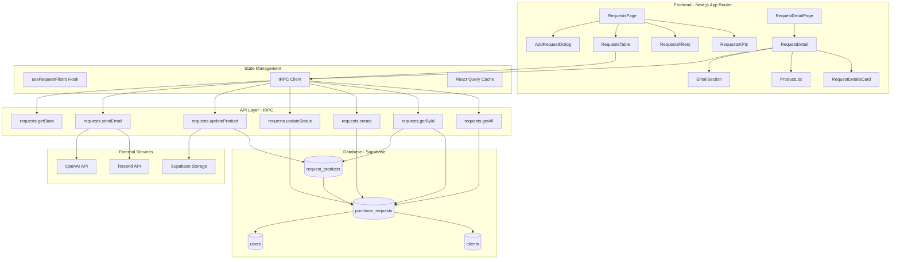

## 🔄 Flujo de Creación de Pedido

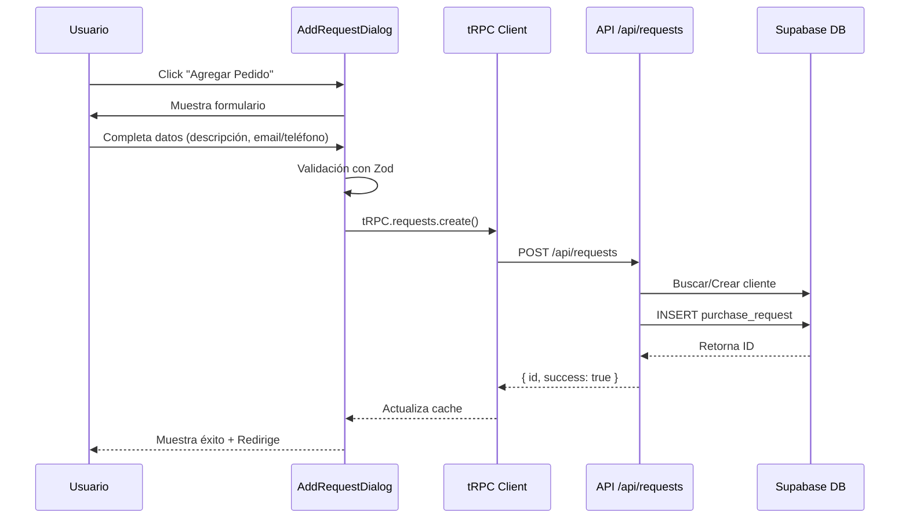

## 📊 Flujo de Listado con Filtros

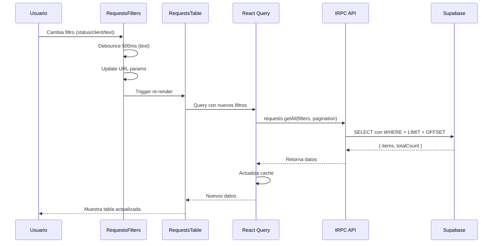

## 🛍️ Flujo de Gestión de Productos

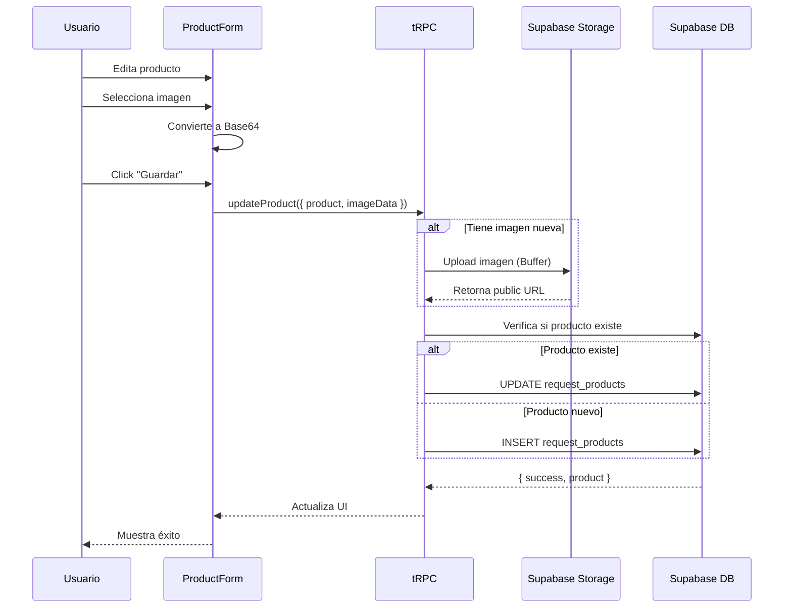

## 📧 Flujo de Envío de Email

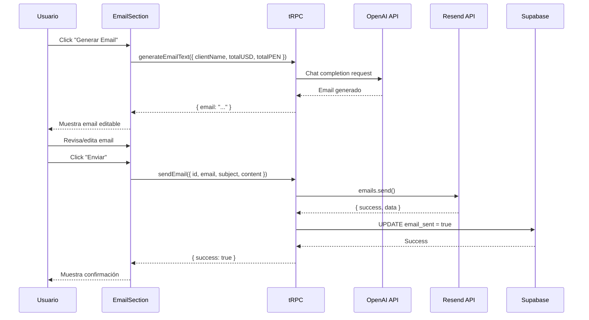

## 📈 Flujo de KPIs y Estadísticas

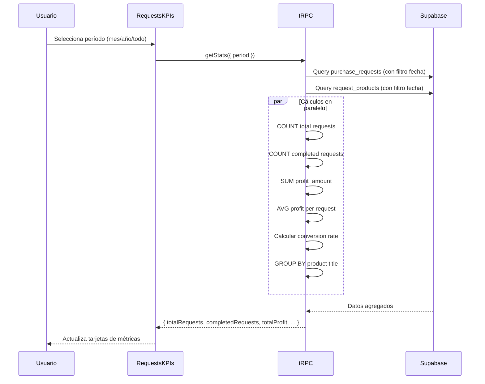

## 🗄️ Modelo de Datos - Relaciones

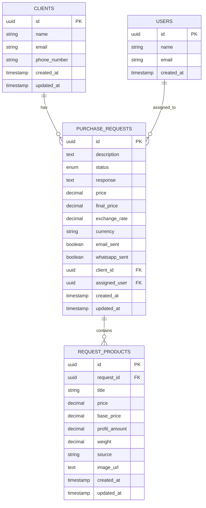

## 🔄 Máquina de Estados

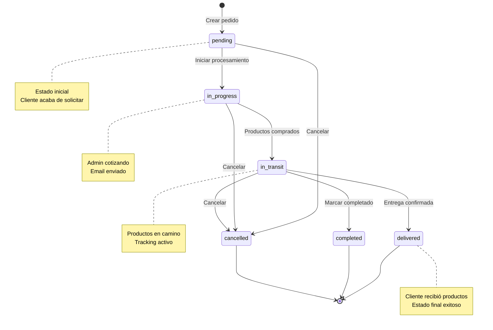

## 🎨 Componentes - Jerarquía

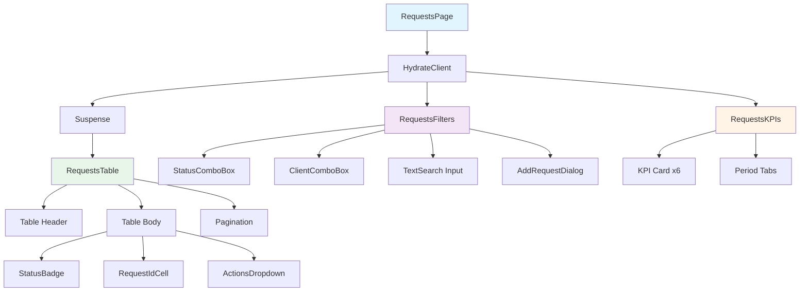

## 📱 Flujo de Usuario - Caso de Uso Completo

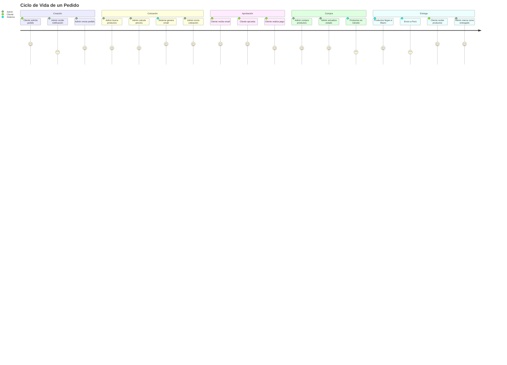

## 🔐 Seguridad y Permisos

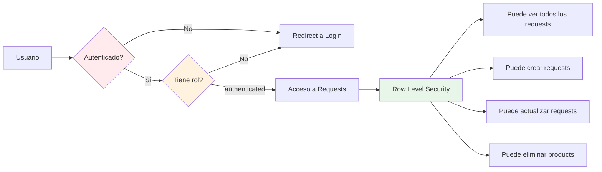

## 📊 Métricas y KPIs - Cálculos

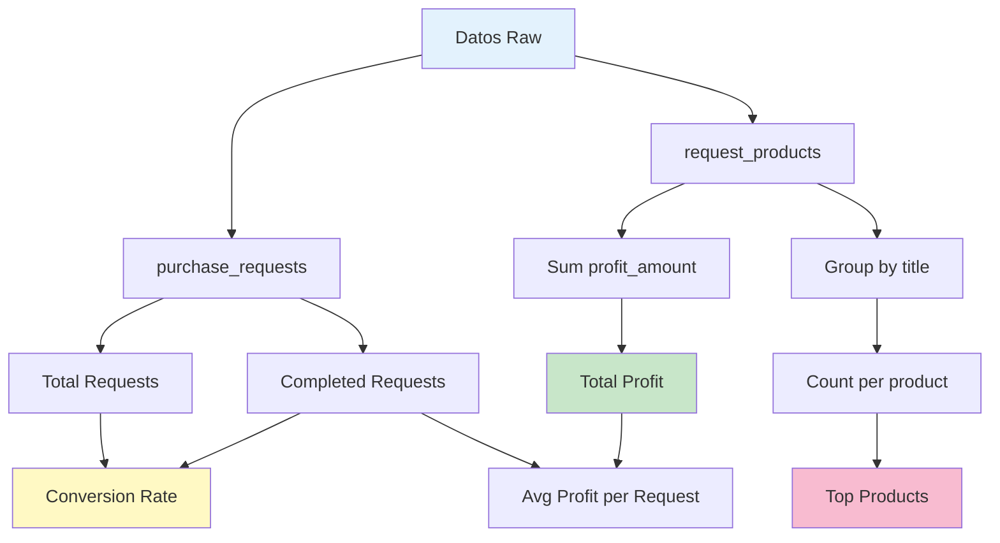
